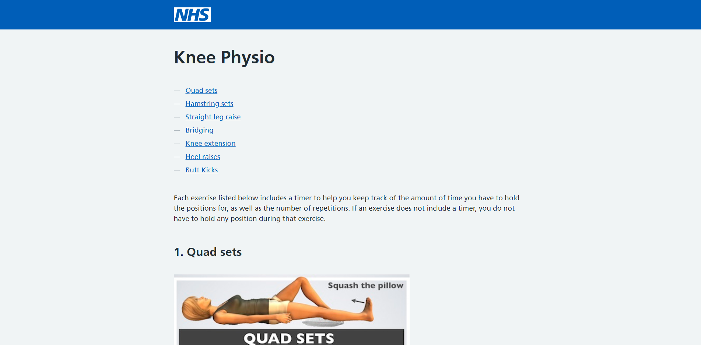

# NHS Knee Physio


## About this Project



I created this project for my mum to make it easier for her to manage her knee physio. The doctors initially sent her a cheat sheet of the exercises she was meant to do but they lacked any explanation on how to do them. I found the source of this image - a website containing instructions and separate images for each exercise. This was good, but I found some of the instructions could do with a slightly simpler explanation.

Another issue was tracking the number of reps, the time spent holding each position, and the time spent rested between each rep - often she would forget which rep she was on after focusing on the timings. This discouraged her from doing the exercises in the first place.

My solution was to create a simple web app that explained how to do each exercise in a more understandable way, and to provide a timer to help her keep track of the exercises. For some of these exercises you are lying on the floor and therefore cannot see a screen, so I included verbal instructions along with written ones with each timer.

She no longer has to count the reps or watch a clock. All she has to do is focus on the exercise. An addition was made that allows you to adjust the timings and reps of each exercise as this seemed to be a common request.

### Built with

- Nuxt.js
- NHS UK Frontend

## Getting Started

### Prerequisites

- Node

### Installation

1. Install the dependencies.

```
npm i
```

2. Run the app locally with hot reloading.

```
npm run dev
```

Go to http://localhost:3000

## Deployment

This project is hosted on GitHub pages.

1. Build the static pages.

```
npm run generate
```

2. Commit to the GitHub repo that has GitHub pages setup for the `/docs` directory.

```
git push
```

See usage

## Usage

https://benpaullamb.github.io/knee-physio/

## Roadmap

No planned features

## Release History

- v0.2.1
  - exercise settings
- v0.2.0
  - NHS UK redesign
  - timers
- v0.1.0
  - initial design
